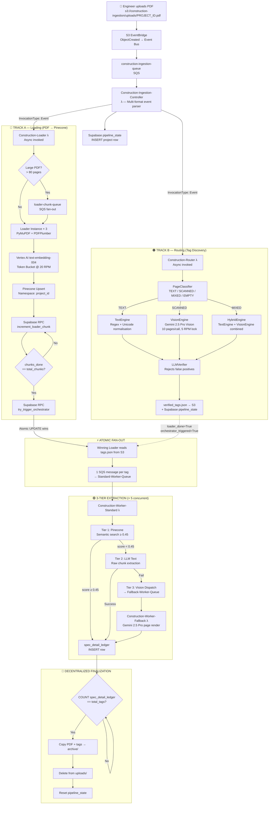
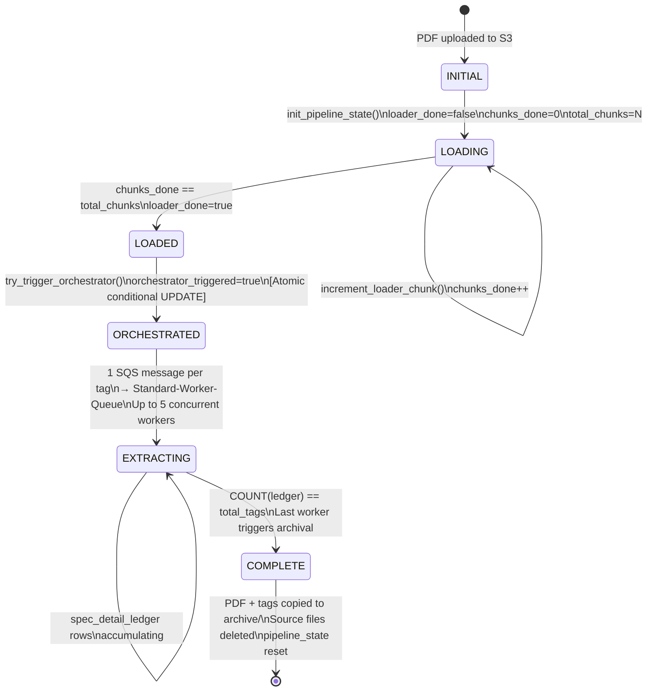

# DESIGN.md — System Architecture & Engineering Deep-Dive

> **SEC RAG Intelligence | AEC Document Intelligence Pipeline**
> *A production-grade, event-driven extraction system for US commercial construction specification documents*

---

## Table of Contents

1. [Executive Architecture Overview](#1-executive-architecture-overview)
2. [Complete AWS Resource Inventory](#2-complete-aws-resource-inventory)
3. [End-to-End Data Flow](#3-end-to-end-data-flow)
4. [Resilience & Reliability Mechanisms](#4-resilience--reliability-mechanisms)
5. [IP Fortress — PromptVault Architecture](#5-ip-fortress--promptvault-architecture)
6. [Supabase State Machine](#6-supabase-state-machine)
7. [Competitive Moat](#7-competitive-moat)
8. [Repository Structure](#8-repository-structure)

---

## 1. Executive Architecture Overview

This pipeline is a **serverless, event-driven, fan-out extraction system** purpose-built for the AEC (Architecture, Engineering, Construction) industry. It processes unstructured US commercial construction specification PDFs — documents that routinely exceed 1,300 pages, contain mixed OCR-scanned/digital layers, and embed finish schedule data inside visually complex tables — and transforms them into legally defensible, structured records at sub-second retrieval latency.

### Governing Design Principles

| Principle | Implementation Decision |
|---|---|
| **Fan-Out / Fan-In** | SQS as the decentralized message bus; each approved tag becomes an independent unit of work |
| **Decentralized State Coordination** | Supabase PostgreSQL RPC functions mediate all distributed state transitions atomically |
| **Cost-Efficiency-First Extraction Cascade** | Cheap modalities (text regex → semantic search) are fully exhausted before expensive Vision API calls are dispatched |
| **IP Fortress** | `PromptVault` abstraction shields proprietary AEC domain knowledge; PhD-level tuned prompts are injected at Lambda startup via env vars |
| **Self-Healing Idempotency** | Every stateful operation is guarded by conditional writes, claim tokens, and atomic RPCs — safe under any failure or retry scenario |

### The Fundamental Problem This Solves

A 1,300-page construction specification PDF from a New York school renovation project contains ~400 unique finish tags (`PT-1A`, `TM-606`, `VWC-3`) scattered across non-contiguous schedules, specification divisions, and handwritten annotation layers. Extracting manufacturer, model series, and finish color from each tag requires:

- **Multimodal intelligence** (digital text, scanned images, hand-drawn tables all exist within the same document)
- **Domain vocabulary** (CSI MasterFormat codes, AEC manufacturer databases, finish schedule column header aliases)
- **Distributed concurrency** (independent tags can be extracted in parallel with no shared mutable state)
- **Legal traceability** (every extracted value must be traceable to a specific page number and evidence excerpt)

No general-purpose LLM pipeline addresses all four constraints simultaneously at this document scale. This system was engineered to.

---

## 2. Complete AWS Resource Inventory

### 2.1 Amazon S3 — `construction-ingestion`

The S3 bucket functions as the system's durable input/output surface and archival store. EventBridge intercepts all `ObjectCreated` events and routes them to the ingestion queue, creating a clean decoupling between upload mechanics and processing logic.

| Prefix | Purpose |
|---|---|
| `uploads/` | Source PDFs awaiting or currently undergoing processing |
| `tags/` | Router output (`<PROJECT_ID>_verified_tags.json`) deposited after discovery |
| `archive/<PROJECT_ID>/` | Immutable post-processing archive: source PDF + tags file copied here on pipeline completion |

> **Architectural note:** The `archive/` write is intentionally a **copy-then-delete** (not a move) so that any mid-archival failure leaves the source intact in `uploads/` and permits a clean re-trigger.

### 2.2 Amazon SQS Queue Topology

Every queue in this system uses **batch size = 1**. This is a deliberate design choice: a single slow Vision API call or a single corrupt PDF chunk must never block the processing of other messages. Throughput is recovered via Lambda concurrency, not batching.

| Queue | Visibility Timeout | Max Receive Count | DLQ | Role |
|---|---|---|---|---|
| `construction-ingestion-queue` | 900s | 3 | None | Entry point; receives S3 ObjectCreated events from EventBridge |
| `loader-chunk-queue` | **1800s** | 3 | `loader-chunk-dlq` | PDF chunk fan-out for large documents; double timeout accommodates slow Pinecone upserts |
| `loader-chunk-dlq` | 30s | N/A | N/A | Dead letter sink for failed chunk processing; available for manual redrive |
| `Standard-Worker-Queue` | **905s** | 3 | `Standard-Worker-DLQ` | Tag extraction fan-out; 905s = Lambda max (900s) + 5s buffer |
| `Standard-Worker-DLQ` | 30s | N/A | N/A | Failed standard extraction tasks |
| `Fallback-Worker-Queue` | 905s | 3 | `Fallback-Worker-DLQ` | Vision-agentic fallback for tags that defeat text/semantic extraction |
| `Fallback-Worker-DLQ` | 30s | N/A | N/A | Failed vision extraction tasks |

> **The 905-second rule:** Standard/Fallback queue visibility is set to `Lambda_timeout + 5s`. This 5-second buffer ensures SQS does not re-enqueue a message while the Lambda function is still executing its final `db_write` and acknowledgment. The Loader queue uses `1800s` (2× Lambda timeout) because Pinecone batch upserts on large pages can push processing to the very edge of the Lambda limit.

### 2.3 AWS Lambda Function Inventory

| Function | Trigger Mechanism | Reserved Concurrency | Timeout | Core Responsibility |
|---|---|---|---|---|
| `Construction-Ingestion-Controller` | `construction-ingestion-queue` (SQS) | Default | 15 min | Multi-format event parsing; pipeline state init; async fan-out invocation of Loader + Router |
| `Construction-Router` | Async (Lambda invoke `Event` type) | Default | 15 min | 3-engine tag discovery; LLM verification; `verified_tags.json` → S3 + Supabase |
| `Construction-Loader` | `loader-chunk-queue` (SQS) | **3** | 15 min | PyMuPDF OCR + PDFPlumber table parse; Vertex AI embedding; Pinecone upsert; atomic chunk counter |
| `Construction-Worker-Standard` | `Standard-Worker-Queue` (SQS) | **5** | 15 min | 3-tier extraction cascade (Pinecone → LLM text → Vision dispatch); `spec_detail_ledger` write |
| `Construction-Worker-Fallback` | `Fallback-Worker-Queue` (SQS) | **5** | 15 min | Vision-agentic page rendering via Gemini 2.5 Pro; structured extraction for unresolvable tags |

**Concurrency rationale:**
- Loader capped at **3**: Pinecone upsert throughput and Vertex AI embedding RPM limits bound at this value; over-provisioning causes rate-limit cascades.
- Standard/Fallback Workers at **5**: Empirically derived from Supabase connection pool limits and Gemini API concurrency caps; 5 workers provide the optimal throughput/cost ratio.

### 2.4 Supabase PostgreSQL — Table Definitions

| Table | Primary Role | Key Columns |
|---|---|---|
| `pipeline_state` | Central project state machine | `project_id`, `loader_done`, `chunks_done`, `total_chunks`, `orchestrator_triggered`, `approved_tags` |
| `pipeline_chunks` | Granular chunk progress tracking | `project_id`, `chunk_index`, `status` |
| `spec_detail_ledger` | Canonical extraction output store | `project_id`, `finish_tag`, `manufacturer`, `model_series`, `finish_color`, `extraction_method`, `confidence`, `evidence_excerpt`, `page_reference` |
| `document_page_claims` | Vision worker deduplication | `project_id`, `page_batch`, `claimed_by` (worker instance UUID) |

### 2.5 Pinecone Vector Index — `construction-vertex-index`

| Parameter | Value |
|---|---|
| Dimensions | 1536 (Google `text-embedding-004`) |
| Similarity Metric | Cosine |
| Namespace Strategy | Per `project_id` (complete isolation between projects) |
| Metadata Schema | `page_num`, `chunk_id`, `source_document`, `row_text` |
| Score Threshold | 0.45 (tuned for AEC table OCR noise tolerance) |

> **Why 0.45?** Standard semantic search thresholds (0.7+) routinely miss finish schedule evidence because OCR artifacts and multi-line table cell formatting degrade embedding fidelity. Lowering the threshold to 0.45 recovers these matches while the downstream LLM verifier filters false positives — a two-stage precision/recall trade-off that outperforms single-threshold retrieval.

---

## 3. End-to-End Data Flow

### 3.1 Architecture Diagram



### 3.2 Step-by-Step Processing Narrative

#### Step 1 — PDF Ingestion & Controller Initialization

An engineer uploads a project specification PDF to `s3://construction-ingestion/uploads/<PROJECT_ID>.pdf`. S3 emits an `ObjectCreated` event to EventBridge, which routes it to `construction-ingestion-queue`.

The **Ingestion Controller** Lambda fires and must handle three distinct event envelope formats that AWS has produced across different S3/EventBridge integration generations:

```python
# Three-path event format resolution
s3_data = (
    body.get('detail', {}).get('object')          # EventBridge native format
    or body.get('s3', {}).get('object')           # S3 legacy notification format
    or body.get('Records', [{}])[0]               # Direct SQS body format
        .get('s3', {}).get('object')
)
```

After resolving the S3 key and extracting `project_id` from the filename stem, the Controller:
1. Calls `init_pipeline_state(project_id)` in Supabase — inserting the canonical project row.
2. Asynchronously invokes `Construction-Loader` with `InvocationType='Event'` (fire-and-forget).
3. Asynchronously invokes `Construction-Router` with `InvocationType='Event'` (fire-and-forget).

Both downstream invocations are non-blocking. The Controller's only job is to initialize state and delegate — it never waits for results.

---

#### Step 2 — Track A: PDF Loading (PDF → Pinecone)

The **Construction-Loader** receives the S3 event and begins processing. For documents exceeding 80 pages, the **Timeout Guard** activates:

1. The first Loader instance splits the PDF into 80-page chunks.
2. Each chunk descriptor is enqueued to `loader-chunk-queue` as an independent SQS message.
3. Up to 3 concurrent Loader Lambdas process chunks in parallel.

Within each Loader instance, the extraction pipeline operates as follows:

**Text Extraction — PyMuPDF + PDFPlumber:**

PyMuPDF (`fitz`) handles the primary page text extraction. PDFPlumber is invoked specifically for tabular regions, which PyMuPDF's stream-based extractor handles poorly for merged cells. A critical sanitization step prevents vector corruption from multi-line cell values:

```python
# Sanitize internal newlines that would corrupt CSV/vector rows
clean_row = [str(cell).replace("\n", " ").strip() for cell in row]
```

**Embedding — Vertex AI `text-embedding-004`:**

Pages are batched in groups of 15 and submitted to Google Vertex AI's `text-embedding-004` model (1536 dimensions). A **Token Bucket rate limiter** enforces the 20 RPM API constraint without throttle errors:

```python
# Token bucket enforcement: max 20 RPM global
if not rate_limiter.acquire(timeout=30):
    raise RuntimeError("Embedding rate limit exceeded — backing off")
```

**Pinecone Upsert:**
Vectors are upserted to the `construction-vertex-index` under the project-specific namespace with full metadata: `page_num`, `chunk_id`, `source_document`, `row_text`.

**Atomic Progress Reporting:**
After each successful upsert, the Loader calls the `increment_loader_chunk` Supabase RPC — an atomic `UPDATE ... RETURNING` that increments `chunks_done` and returns the updated row. When `chunks_done == total_chunks`, this Loader instance is the convergence point and calls `try_trigger_orchestrator`.

---

#### Step 3 — Track B: Router (Tag Discovery)

The **Construction-Router** runs fully in parallel with Track A. Its mission is to identify every unique finish tag in the document before the workers are dispatched, preventing speculative or incomplete fan-out.

**Stage 1 — PageClassifier:**

Every page is classified into one of four categories by measuring text density against a calibrated threshold:

| Class | Criteria | Next Step |
|---|---|---|
| `TEXT` | High character density, recognizable text blocks | TextEngine |
| `SCANNED` | Low density, likely rasterized image layer | VisionEngine |
| `MIXED` | Intermediate density, partial OCR confidence | HybridEngine |
| `EMPTY` | Below minimum density threshold | Skip |

**Stage 2a — TextEngine:**

Regex-based mining of digital text with **Unicode normalization**: a 10-variant dash map resolves em-dashes, en-dashes, non-breaking hyphens, and Unicode hyphen-minuses that appear interchangeably in construction document OCR output. Without this normalization, `PT–1A` (en-dash) and `PT-1A` (hyphen) appear as two different tags.

**Stage 2b — VisionEngine:**

Scanned and mixed pages are batched (10 pages/call) and submitted to **Gemini 2.5 Pro Vision** with a structured extraction prompt from `PromptVault`. A 5 RPM global lock (implemented as a distributed Supabase semaphore) prevents concurrent Router instances from exceeding the Vision API rate limit.

**Stage 2c — HybridEngine:**

For `MIXED` pages, both TextEngine and VisionEngine are run independently and their candidate sets are merged with deduplication — capturing tags that partial OCR may have fractured.

**Stage 3 — LLMVerifier:**

All discovered candidates are passed through the LLM Verifier, which applies a purpose-built prompt from `PromptVault` to reject false positives — specifically:
- **Paint codes** (e.g., `SW-7012` — a Sherwin-Williams color, not a finish schedule tag)
- **Sheet reference numbers** (e.g., `A-301` — an architectural drawing reference)
- **CSI division numbers** (e.g., `09 65 00` — a specification section, not a tag)

The verified tag list is written to `s3://construction-ingestion/tags/<PROJECT_ID>_verified_tags.json` and stored in `pipeline_state.approved_tags`.

---

#### Step 4 — Atomic Fan-Out Trigger

The convergence of Track A and Track B is managed by the Supabase RPC `try_trigger_orchestrator`:

```sql
UPDATE pipeline_state
SET orchestrator_triggered = TRUE
WHERE project_id = $1
  AND loader_done = TRUE
  AND router_done = TRUE
  AND orchestrator_triggered = FALSE
RETURNING project_id;
```

This conditional `UPDATE ... RETURNING` is the system's distributed mutex. PostgreSQL's row-level locking guarantees that exactly **one** Loader instance will receive a non-empty return from this RPC, regardless of how many parallel instances reach this point simultaneously. The winning instance proceeds to:

1. Read `verified_tags.json` from S3.
2. Enqueue **one SQS message per tag** to `Standard-Worker-Queue`.

With up to 5 concurrent Standard Workers, the extraction phase fans out immediately upon the first fan-out message arriving.

---

#### Step 5 — 3-Tier Extraction Cascade

Each **Construction-Worker-Standard** instance receives a message containing:

```json
{
  "project_id": "PROJECT_ID",
  "tag": "PT-1A",
  "total_tags": 47,
  "tags_key": "tags/PROJECT_ID_verified_tags.json",
  "approved_tags": ["PT-1A", "TM-606", "VWC-3", "..."]
}
```

The worker executes extraction in strict cost-ascending order:

**Tier 1 — Pinecone Semantic Search:**

Queries the project namespace with the tag as the search string. If any result exceeds `score_threshold=0.45`, the top result's `row_text` is extracted as evidence and the structured row is written to `spec_detail_ledger`.

**Tier 2 — LLM Text Extraction:**

If no Pinecone result clears the threshold, the worker retrieves raw text chunks from Supabase, constructs a structured prompt via `PromptVault.get_extractor_text_prompt()`, and submits to the LLM. Successful structured JSON responses yield a `spec_detail_ledger` row with `extraction_method='llm_text'`.

**Tier 3 — Vision Dispatch:**

If text extraction also fails (malformed LLM response, or confident absence of relevant text evidence), the worker enqueues a message to `Fallback-Worker-Queue` containing the candidate page range. The **Construction-Worker-Fallback** renders those pages via Gemini 2.5 Pro Vision, using `PromptVault.get_extractor_vision_prompt()` for agentic extraction.

---

#### Step 6 — Decentralized Finalization

There is no dedicated "finalization" Lambda. Instead, **every worker** becomes a potential finalizer:

```python
# After writing to spec_detail_ledger
completed = supabase.rpc("count_ledger_rows", {"p_project_id": project_id}).execute()
if completed.data == total_tags:
    # This is the last worker — trigger archival
    archive_project(project_id, bucket, key)
    cleanup_source_files(project_id, bucket)
    reset_pipeline_state(project_id)
```

This design eliminates the need for a synchronization Lambda, removes a potential single point of failure, and distributes the finalization check across all workers with zero additional infrastructure.

---

## 4. Resilience & Reliability Mechanisms

### 4.1 SQS Visibility Timeout Architecture

The visibility timeout values in this system are not arbitrary — they encode an explicit contract with the Lambda runtime:

```
Standard/Fallback: 905s = Lambda max (900s) + 5s acknowledgment buffer
Loader:          1800s = 2× Lambda max (handles Pinecone upsert tail latency)
```

If a Lambda function fails mid-execution (unhandled exception, OOM, timeout), SQS will make the message visible again after the timeout expires. With `MaxReceiveCount=3`, a message gets three independent Lambda attempts before routing to the DLQ for human inspection.

### 4.2 SQS Heartbeat Threading

Long-running Vision API calls (Gemini 2.5 Pro page rendering for a 40-page batch) can approach 8-10 minutes of wall time. Without intervention, SQS would re-deliver the message to another worker midway through, causing duplicate processing.

Every worker spawns a **daemon heartbeat thread** at startup:

```python
def _heartbeat_loop(sqs_client, queue_url, receipt_handle, stop_event):
    while not stop_event.is_set():
        time.sleep(300)  # Every 5 minutes
        if not stop_event.is_set():
            sqs_client.change_message_visibility(
                QueueUrl=queue_url,
                ReceiptHandle=receipt_handle,
                VisibilityTimeout=600  # Extend by 10 minutes
            )

heartbeat_thread = threading.Thread(target=_heartbeat_loop, args=(...), daemon=True)
heartbeat_thread.start()
```

The daemon thread is stopped via the `stop_event` flag immediately after the main worker completes or raises, ensuring no phantom extension after task completion.

### 4.3 Sequential Gatekeeping — Cost-Controlled Vision Fallback

Fallback Workers poll the Standard Worker Queue's `ApproximateNumberOfMessages` attribute before beginning Vision processing. If the Standard queue is non-empty, the Fallback Worker defers its own task by extending its visibility timeout:

```python
approx_count = int(sqs.get_queue_attributes(
    QueueUrl=STANDARD_QUEUE_URL,
    AttributeNames=["ApproximateNumberOfMessages"]
)["Attributes"]["ApproximateNumberOfMessages"])

if approx_count > 0:
    # Standard workers still processing — defer Vision call
    sqs.change_message_visibility(
        QueueUrl=FALLBACK_QUEUE_URL,
        ReceiptHandle=receipt_handle,
        VisibilityTimeout=120  # Re-check in 2 minutes
    )
    return
```

This mechanism ensures that the $0.003/call Vision API is never invoked while a $0.0002/call text extraction might still succeed — a direct cost-governance mechanism embedded in the worker logic itself.

### 4.4 Idempotency Guards

Distributed systems require every operation to be safe under retry. This pipeline enforces idempotency at five distinct layers:

| Layer | Guard Mechanism |
|---|---|
| **Ingestion Controller** | Checks `pipeline_state` before calling `init_pipeline_state`; avoids resetting an in-progress project |
| **Loader** | `pipeline_chunks` row per chunk index; duplicate chunk messages are no-ops |
| **VisionEngine (Router)** | `document_page_claims` table: each page batch is claimed with a worker UUID before processing; duplicate claims are rejected |
| **Fan-Out Trigger** | `try_trigger_orchestrator` conditional UPDATE ensures exactly one SQS fan-out regardless of parallel chunk convergence |
| **Worker Finalization** | `spec_detail_ledger` uses `(project_id, finish_tag)` unique constraint; duplicate writes are idempotent via `ON CONFLICT DO NOTHING` |

### 4.5 Loader Timeout Guard & Self-Restart Chain

Lambda's 15-minute hard limit is insufficient for processing 1,300-page specification documents in a single execution. The Loader solves this with a **self-restart chain**:

```
[Pages 1–80]     → Loader Instance 1 → processes, reaches 13-min mark
                                      → calculates remaining range (81–960)
                                      → enqueues continuation to loader-chunk-queue
                                      → Lambda returns normally

[Pages 81–160]   → Loader Instance 2 (fresh 15-min window)
[Pages 161–240]  → Loader Instance 3 (fresh 15-min window)
...
```

The Timeout Guard monitors elapsed time **per page iteration**:

```python
elapsed = time.time() - start_time
if elapsed > 780:  # 13 minutes — 2-minute buffer before hard limit
    remaining_start = current_page + 1
    if remaining_start < total_pages:
        enqueue_chunk(project_id, bucket, key, remaining_start, total_pages)
    break  # Return normally — chain continues via SQS
```

This enables processing of arbitrarily large PDFs through a sequence of fresh Lambda executions, each operating well within its timeout budget.

### 4.6 Jittered Exponential Backoff

All API retry loops use jittered exponential backoff to prevent thundering-herd behavior under parallel load:

```python
# Standard retry formula — Lambda-safe maximum
sleep_duration = (2 ** attempt * 10) + random.uniform(0, 10)
# attempt=0 → 10–20s  |  attempt=1 → 20–30s  |  attempt=2 → 40–50s
# Max 3 retries → max wait ~50s (well within 900s Lambda timeout)
```

The jitter term `random.uniform(0, 10)` desynchronizes retry storms when multiple concurrent workers hit the same rate limit simultaneously — a common failure mode in naive retry implementations.

### 4.7 Error Handling Cascade

```
Lambda raises RuntimeError (db_success=False)
    → SQS retries message (up to MaxReceiveCount=3)
    → If all 3 retries fail: message routes to DLQ
    → DLQ messages persist indefinitely for manual redrive/audit
    → dry_run mode: writes placeholder record with extraction_method='verification_needed'
```

The `dry_run` path is critical for legal compliance: even when all extraction attempts fail, a row is written to `spec_detail_ledger` with the tag and `verification_needed` status. This ensures the output ledger contains a complete record of every approved tag — with no silent omissions.

---

## 5. IP Fortress — PromptVault Architecture

### 5.1 Architecture Philosophy

`src/core/vault.py` is the **single source of truth** for all LLM prompt templates and AEC domain configuration in this pipeline. Every agent, every worker, every router stage retrieves its operational parameters exclusively through `PromptVault` method calls — never through hardcoded string literals.

This design serves two simultaneous goals:

1. **Production Agility**: In AWS Lambda, environment variables are injected at cold start. PhD-level tuned prompts, proprietary AEC vocabulary registries, and confidence calibration parameters can be updated without a single line of code change or a new deployment — just an env var update and a function restart.

2. **IP Protection**: The repository ships with high-fidelity demonstration templates that showcase architectural sophistication and domain fluency. Production parameters — the result of extensive empirical tuning against real AEC specification corpora — remain confidential.

```python
class PromptVault:
    @staticmethod
    def get_extractor_vision_prompt() -> str:
        # Production: PhD-level vision extraction prompt injected via VAULT_EXTRACTOR_VISION_PROMPT
        # Repository: Architectural demonstration template
        return os.environ.get("VAULT_EXTRACTOR_VISION_PROMPT", _DEMO_EXTRACTOR_VISION_PROMPT)
```

### 5.2 PromptVault Method Registry

| Method | Env Var Override | Purpose |
|---|---|---|
| `get_extractor_vision_prompt()` | `VAULT_EXTRACTOR_VISION_PROMPT` | Gemini Vision extraction prompt for finish schedule page rendering |
| `get_extractor_text_prompt()` | `VAULT_EXTRACTOR_TEXT_PROMPT` | LLM text extraction prompt for digital PDF layers |
| `get_router_verifier_prompt()` | `VAULT_ROUTER_VERIFIER_PROMPT` | Tag candidate validation and false-positive rejection rules |
| `get_router_vision_prompt()` | `VAULT_ROUTER_VISION_PROMPT` | Vision-based tag discovery prompt for scanned pages |
| `get_fallback_hybrid_prompt()` | `VAULT_FALLBACK_HYBRID_PROMPT` | Combined text+vision resolution for ambiguous evidence |
| `get_domain_tag_prefix_map()` | — | AEC vocabulary registry: prefix → finish category mapping |
| `get_known_finish_prefixes()` | — | Complete set of valid CSI-aligned tag prefixes |
| `get_header_aliases()` | — | Dynamic finish schedule column header detection mappings |
| `get_manufacturer_keywords()` | — | Evidence ranking signals for manufacturer name extraction |

### 5.3 The "Readable but Not Replicable" Principle

The vault design embodies a core IP strategy: the codebase is fully readable, the architecture is fully demonstrable, and the domain expertise is visibly present — but the specific parameterizations that drive production-grade accuracy cannot be extracted from the repository. An engineer reading the source code understands *that* a verifier prompt exists and *what* it is responsible for; they do not obtain the tuned prompt itself.

---

## 6. Supabase State Machine

### 6.1 Pipeline State Diagram



### 6.2 State Transition Reference

| State | `loader_done` | `chunks_done` | `orchestrator_triggered` | Ledger Count |
|---|---|---|---|---|
| `INITIAL` | `false` | `0` | `false` | `0` |
| `LOADING` | `false` | `1 ... N-1` | `false` | `0` |
| `LOADED` | `true` | `N` | `false` | `0` |
| `ORCHESTRATED` | `true` | `N` | `true` | `0` |
| `EXTRACTING` | `true` | `N` | `true` | `1 ... M-1` |
| `COMPLETE` | Reset | Reset | Reset | `M` (all tags extracted) |

### 6.3 The `try_trigger_orchestrator` RPC

This RPC is the most critical piece of distributed coordination logic in the pipeline. It must tolerate the following race condition: multiple Loader Lambda instances finishing their final chunk within milliseconds of each other, all attempting to trigger the orchestration fan-out simultaneously.

```sql
-- src/database/rpcs/try_trigger_orchestrator.sql
CREATE OR REPLACE FUNCTION try_trigger_orchestrator(p_project_id TEXT)
RETURNS TABLE(triggered BOOLEAN) AS $$
BEGIN
    UPDATE pipeline_state
    SET orchestrator_triggered = TRUE
    WHERE project_id = p_project_id
      AND loader_done = TRUE
      AND router_done = TRUE
      AND orchestrator_triggered = FALSE;

    RETURN QUERY SELECT found;  -- TRUE only for the first successful UPDATE
END;
$$ LANGUAGE plpgsql;
```

PostgreSQL's MVCC ensures that the `WHERE orchestrator_triggered = FALSE` predicate is evaluated under a consistent snapshot. Only one concurrent caller will observe `found = TRUE` and proceed to fan-out. All other callers receive `found = FALSE` and exit cleanly — no duplicate fan-outs, no coordination overhead, no distributed locks.

---

## 7. Competitive Moat

This pipeline was designed to solve problems that general-purpose LLM interfaces structurally cannot address. The following comparison is grounded in the specific constraints of professional AEC document intelligence.

| Capability | Generic LLM (ChatGPT / Claude) | SEC RAG Intelligence |
|---|---|---|
| **Context Window Scaling** | Hard context limit (~200K tokens); "Lost-in-the-Middle" degradation on long documents means evidence on page 800 is effectively invisible | Pinecone ensures only the exact 0.01% of relevant evidence is retrieved; accuracy is **invariant to document length** — a 1,300-page spec performs identically to a 50-page one |
| **Legal Auditability** | Returns an answer with no verifiable source reference; unusable for professional engineering liability | Every `spec_detail_ledger` row contains `chunk_id`, `page_num`, `evidence_excerpt`, and `extraction_method` — a permanent, auditable trail for professional liability protection |
| **OCR & Unicode Resilience** | Standard text input; cannot handle scanned layers or multi-line table cells | PyMuPDF + PDFPlumber + 10-variant Unicode dash normalization + Gemini Vision fallback covers every document modality |
| **Hallucination Prevention** | LLM may confidently fabricate a manufacturer name when evidence is ambiguous | 3-tier cascade with evidence grounding: every extraction is backed by a retrieved text chunk or a rendered page image; unresolvable tags produce `verification_needed` status, never fabricated values |
| **Cost Per Document** | API cost scales linearly with document length (entire doc submitted to context) | Cost scales with **tag count**, not page count; Pinecone retrieval eliminates 99%+ of tokens from LLM submission |
| **Processing Time** | Sequential; limited by context window fill time for large documents | Parallel fan-out across 5 concurrent workers; tag extraction is embarrassingly parallel |
| **No-Judgment Workers** | LLM may reject a valid 3-digit tag (`TM-606`) as a "product code" based on superficial pattern matching | Workers follow strict Orchestrator orders; Router approval is final — Workers are pure extraction nodes with zero subjective filtering |
| **Multimodal Table Intelligence** | Standard chat OCR is unreliable for complex pipe-separated or multi-column finish schedules | Dedicated Vision-Agentic Flow re-renders source pages in full fidelity; correlates visual table rows with semantic text |
| **Rate Limit Management** | None | Token Bucket (Vertex AI), distributed Supabase semaphore (Gemini Vision), jittered backoff (all APIs) |
| **Failure Recovery** | Session-based; failure requires full restart | SQS DLQ + manual redrive; any failed tag is independently retriable without reprocessing the entire document |

---

## 8. Repository Structure

```
project/
├── src/
│   ├── agents/
│   │   ├── router_agent.py          # PageClassifier, TextEngine, VisionEngine, HybridEngine, LLMVerifier
│   │   └── extractor_worker.py      # 3-tier extraction cascade, SQS heartbeat, finalization logic
│   ├── core/
│   │   └── vault.py                 # PromptVault — single source of truth for all prompts + AEC config
│   ├── database/
│   │   └── supabase_db.py           # Supabase client, RPC wrappers, state machine operations
│   ├── lambda/
│   │   ├── ingestion_controller.py  # Multi-format event parser, async fan-out entrypoint
│   │   ├── worker.py                # Standard-Worker-Queue Lambda handler
│   │   └── fallback_worker.py       # Fallback-Worker-Queue Lambda handler (Vision-agentic)
│   ├── pipeline/                    # Loader pipeline: chunking, embedding, Pinecone upsert
│   ├── schemas/                     # Pydantic models for ledger rows, tag structures, state
│   └── utils/                       # Token bucket rate limiter, jitter backoff, logging
├── Dockerfile                       # Lambda container image build
├── requirements.txt                 # Production dependencies
├── DESIGN.md                        # ← This document
└── README.md                        # Project overview and deployment guide
```

---

## Appendix — Key Engineering Decisions Log

| Decision | Alternatives Considered | Rationale |
|---|---|---|
| **SQS batch size = 1** | Batch size 5–10 for throughput | One slow Vision call blocks entire batch; concurrency provides throughput, not batching |
| **Loader concurrency = 3** | Higher concurrency for faster loading | Pinecone upsert + Vertex AI RPM limits bound useful throughput at 3; beyond this, rate-limit retries dominate |
| **Supabase PostgreSQL for state** | DynamoDB, Redis | RPC-based atomic conditional UPDATE is trivial in PostgreSQL; DynamoDB conditional writes require more complex expression syntax; Redis adds operational overhead |
| **Cosine similarity @ 0.45** | Threshold 0.6–0.7 (industry standard) | AEC table OCR artifacts degrade embedding fidelity; 0.45 recovers edge-case matches; downstream LLM verifier handles precision |
| **No dedicated Finalization Lambda** | Orchestrator Lambda polling for completion | Removes a polling loop and a single point of failure; distributes the finalization check across workers that are already running |
| **Daemon heartbeat thread** | Shorter queue visibility timeout | Visibility timeout must be predictable; heartbeat allows unlimited task duration without queue configuration changes |
| **`text-embedding-004` (1536d)** | `text-embedding-ada-002` (OpenAI) | Vertex AI integration with existing GCP credentials; 1536d provides sufficient discriminative capacity for AEC vocabulary |

---

*Document authored for SEC RAG Intelligence — AEC Document Intelligence Pipeline.*
*Architecture: event-driven, serverless, fan-out extraction on AWS Lambda + SQS + Supabase + Pinecone + Vertex AI.*
