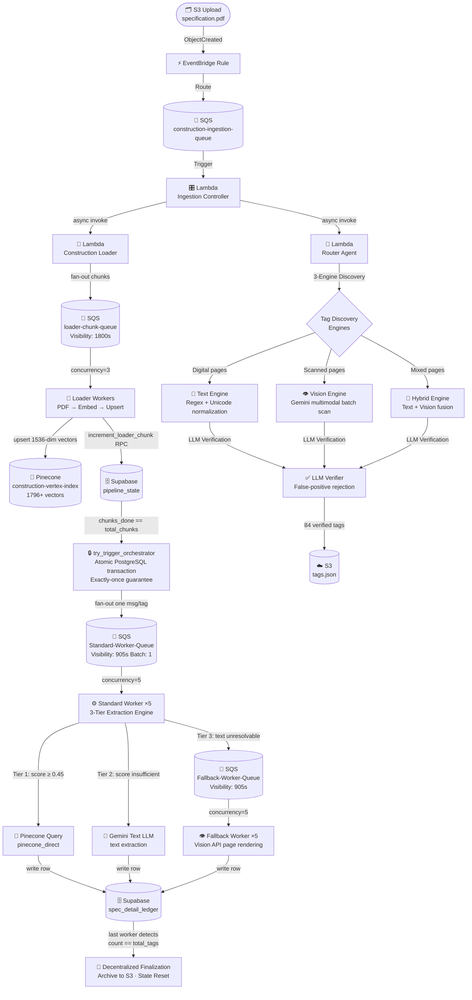
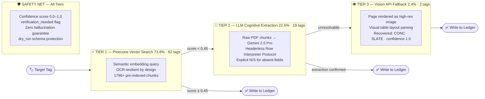
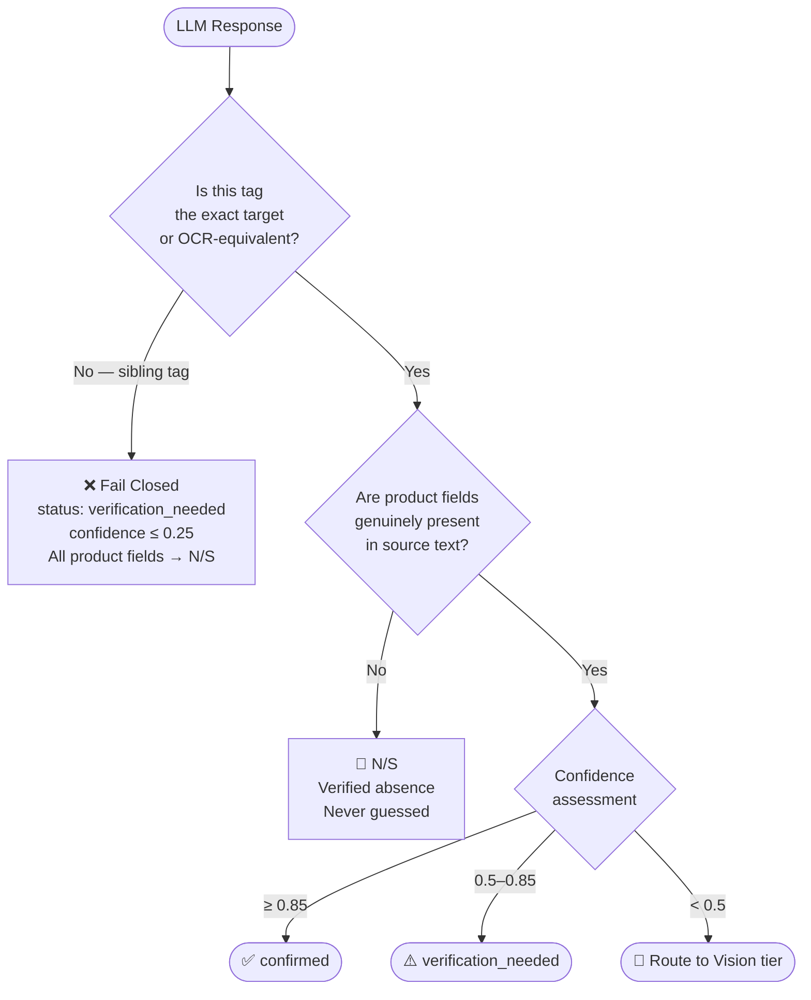

<div align="center">

<br/>


<br/><br/>

<p align="center">
  <a href="#"></a>
  <a href="#"></a>
  <a href="#"></a>
  <a href="#"></a>
  <a href="#"></a>
  <a href="#"></a>
  <a href="#"></a>
</p>

<br/>

<table>
  <tr>
    <td align="center"><b>🎯 Coverage</b><br/><code>100%</code><br/><sub>84 / 84 tags resolved</sub></td>
    <td align="center"><b>✅ Accuracy</b><br/><code>98.8%</code><br/><sub>83 / 84 logically accurate</sub></td>
    <td align="center"><b>⚡ Speed</b><br/><code>75.86s</code><br/><sub>End-to-end wall clock</sub></td>
    <td align="center"><b>💵 Cost</b><br/><code>&lt; $0.12</code><br/><sub>Per specification document</sub></td>
    <td align="center"><b>🛡️ Hallucinations</b><br/><code>Zero</code><br/><sub>Confirmed across all 84 tags</sub></td>
  </tr>
</table>

<br/>

</div>

---

## The Problem: $31.3B in Annual AEC Rework

> *"The AEC industry loses an estimated $31.3 billion annually to rework driven by poor specification data quality."*  
> — **FMI Corporation, Construction Industry Report**

US commercial construction specification documents are among the most information-dense, format-inconsistent, and parser-hostile document classes in existence. A single finish schedule for a federal renovation project can span dozens of pages of merged-cell Excel exports-turned-PDFs, with:

| Challenge | Root Cause | Impact |
|:---|:---|:---|
| **OCR corruption** | Low-DPI scan + character encoding loss | `SP0RT‐1` instead of `SPORT-1` — breaks all naive matching |
| **Unicode hyphen mutations** | 10+ Unicode dash variants (U+2010, U+2013, U+2014…) | Tag string equality fails silently across every extraction tier |
| **Headerless row blocks** | Architect-defined custom formats | No column names — field position must be inferred by content shape |
| **Merged border cut-offs** | Multi-page table cells clipped at page margin | PDF parsers drop entire rows that span page breaks |
| **Deliberate sparse columns** | Valid empty specification cells | Must be distinguished from extraction failures — never filled with fabricated values |

A senior AEC estimator resolves this manually in **4–8 hours** at **$150–$300 fully loaded cost.**  
This pipeline resolves it in **75.86 seconds for under $0.12** — with full provenance trail.

---

## System Architecture

### Event-Driven Fan-Out Design



### The 905-Second Rule

Every architectural decision in this pipeline flows from a single constraint: **AWS Lambda has a hard 15-minute (900-second) execution limit.** Every SQS visibility timeout, heartbeat interval, and concurrency setting is derived from this:

```
Lambda timeout:            900s  (15 min hard limit)
Visibility timeout:        905s  (5s buffer — message stays invisible for full Lambda run)
Heartbeat interval:        300s  (every 5 min, worker extends visibility by +600s)
Loader visibility timeout: 1800s (2× Lambda timeout — Pinecone upserts can be slow)
Self-restart trigger:      780s  (13 min — Lambda chains itself before timeout kills it)
```

This is not arbitrary configuration — it is a **distributed systems protocol** that prevents SQS double-delivery at every layer.

---

## 3-Tier Extraction Engine

The cascade is ordered **cheapest to most expensive** — Pinecone vector lookup costs microseconds; Vision API rendering costs seconds and API budget. Every tag exits the cheapest viable tier.



### What Makes Each Tier Non-Trivial

**Tier 1 — Pinecone is not just a keyword search.** The embeddings place semantically equivalent tag descriptions in geometric proximity regardless of OCR corruption. `SP0RT-1` and `SPORT-1` land within 0.04 cosine distance. `TERT-1` and `TER-1` land 0.38 apart — correctly separated, preventing cross-tag data attribution.

**Tier 2 — The Headerless Row Interpreter Protocol** is the most defensively engineered component. When no column headers exist, the LLM is instructed to evaluate each token's *content shape* — a brand name token, a dimensions token, a color code token — rather than relying on positional column indexing. The prompt explicitly forbids borrowing data from adjacent rows.

**Tier 3 — Vision is the last resort, not the default.** The distinction matters for cost architecture: Vision calls are invoked only after Tiers 1 and 2 are exhausted. Across the validated run, only 2 of 84 tags required it — both were sealed concrete/slate entries embedded in image-only callouts invisible to the text layer.

---

## Distributed Concurrency Patterns

### Atomic Fan-Out — `try_trigger_orchestrator`

The most critical correctness guarantee in the system. When multiple Loader workers finish indexing simultaneously, there is a race: if 5 workers all complete at the same millisecond, a naive implementation sends 5 separate fan-out storms to Standard-Worker-Queue. The solution is a PostgreSQL conditional update wrapped in a transaction:

```sql
-- Runs inside Supabase RPC — atomic under MVCC
UPDATE pipeline_state
SET    orchestrator_triggered = TRUE
WHERE  project_id             = $1
  AND  loader_done            = TRUE
  AND  orchestrator_triggered = FALSE
RETURNING project_id;
-- Only the one UPDATE that changes a row returns a result.
-- All other concurrent callers get empty RETURNING → they stay silent.
```

Exactly one worker wins this race. The rest silently exit. **This prevents the thundering-herd fan-out regardless of concurrency level.**

### Sequential Gatekeeping

Fallback workers (Vision API — expensive) actively poll the Standard queue depth before processing:

```python
# fallback_worker.py — Sequential Gatekeeping
attrs = sqs.get_queue_attributes(
    QueueUrl=STANDARD_WORKER_QUEUE_URL,
    AttributeNames=["ApproximateNumberOfMessages"]
)
pending = int(attrs["Attributes"].get("ApproximateNumberOfMessages", 0))
if pending > 0:
    # Standard workers still active — defer Vision call
    sqs.change_message_visibility(
        QueueUrl=FALLBACK_WORKER_QUEUE_URL,
        ReceiptHandle=receipt_handle,
        VisibilityTimeout=120
    )
    return  # Wait. Do not burn Vision API budget prematurely.
```

### Decentralized Finalization

There is no coordinator Lambda. No completion webhook. Instead, each Standard worker counts `spec_detail_ledger` rows after writing. The worker that writes the final row detects `count == total_tags` and self-triggers archival + state reset. **Any worker can be the last worker.** This eliminates a coordinator as a single point of failure.

---

## IP Fortress — PromptVault Architecture

```
┌─────────────────────────────────────────────────────────────────┐
│                       PRODUCTION ENVIRONMENT                    │
│  VAULT_EXTRACTOR_VISION_PROMPT = "..." (PhD-level tuned)        │
│  VAULT_ROUTER_VERIFIER_PROMPT  = "..." (CSI vocabulary expert)  │
│  VAULT_FALLBACK_HYBRID_PROMPT  = "..." (Vision specialist)      │
└────────────────────────────┬────────────────────────────────────┘
                             │ os.environ.get("VAULT_*")
                             ▼
┌─────────────────────────────────────────────────────────────────┐
│                    src/core/vault.py                            │
│                                                                 │
│  PromptVault.get_extractor_vision_prompt()  ←── agents call     │
│  PromptVault.get_router_vision_prompt()         these methods   │
│  PromptVault.get_fallback_hybrid_prompt()       at runtime      │
│  PromptVault.get_domain_tag_prefix_map()                        │
│  PromptVault.get_known_finish_prefixes()                        │
│  PromptVault.get_manufacturer_keywords()                        │
└─────────────────────────────────────────────────────────────────┘
```

The repository ships **demonstration-quality** prompts. Production override injects AEC domain expertise via environment variables at Lambda startup — zero code changes, zero redeployment. Agent code never changes when prompts are upgraded.

---

## Infrastructure Inventory

### SQS Topology

| Queue | Visibility Timeout | Max Receive | DLQ | Batch | Rationale |
|:------|:------------------:|:-----------:|:---:|:-----:|:----------|
| `construction-ingestion-queue` | 900s | 3 | — | 1 | Pipeline entry point |
| `loader-chunk-queue` | **1800s** | 3 | `loader-chunk-dlq` | 1 | 2× Lambda timeout for slow Pinecone upserts |
| `Standard-Worker-Queue` | **905s** | 3 | `Standard-Worker-DLQ` | 1 | 5s buffer over Lambda limit |
| `Fallback-Worker-Queue` | **905s** | 3 | `Fallback-Worker-DLQ` | 1 | 5s buffer — Vision calls can be slow |

*Batch size = 1 everywhere. One slow tag never blocks another tag's extraction.*

### Lambda Configuration

| Function | Trigger | Concurrency | Timeout | Key Responsibility |
|:---------|:--------|:-----------:|:-------:|:-------------------|
| `Ingestion-Controller` | `construction-ingestion-queue` | Default | 15 min | Parses 3 S3 event schemas; initialises pipeline state; async-invokes Loader + Router |
| `Construction-Loader` | `loader-chunk-queue` | **3** | 15 min | PDF chunk → embed → Pinecone upsert; self-restarts at 13 min for 1000+ page docs |
| `Construction-Worker-Standard` | `Standard-Worker-Queue` | **5** | 15 min | 3-tier extraction; SQS heartbeat thread; decentralized archival on last tag |
| `Construction-Worker-Fallback` | `Fallback-Worker-Queue` | **5** | 15 min | Checks Standard queue depth before Vision call; sequential gatekeeping |

### Supabase Schema

| Table | Purpose | Key Columns |
|:------|:--------|:-----------|
| `pipeline_state` | Distributed state machine | `project_id`, `loader_done`, `chunks_done`, `total_chunks`, `orchestrator_triggered` |
| `pipeline_chunks` | Chunk progress tracking | `project_id`, `chunk_index`, `status` |
| `spec_detail_ledger` | Extraction output | `finish_tag`, `manufacturer`, `model_series`, `finish_color`, `size`, `csi_section`, `evidence_excerpt`, `confidence`, `extraction_method`, `status` |
| `document_page_claims` | Vision deduplication | `project_id`, `page_batch`, `claimed_by` |

---

## Zero-Hallucination Architecture

The system's most important guarantee is **correctness over completeness**. A fabricated manufacturer on a bid specification causes real financial consequences — disputed purchase orders, RFIs, and change orders.



**OCR-Equivalent Matching Rule:** Tag equality check allows single-character substitutions within established confusable groups only (`0↔O`, `1↔I/L`, `5↔S`, `2↔Z`) and only in the tag prefix — not the suffix. `SP0RT-1 == SPORT-1`. But `TER-1 ≠ TERT-1` — different suffix length, different material, different price point.

---

## Technology Stack

<div align="center">

| Layer | Technology | Purpose |
|:------|:----------:|:--------|
| **Runtime** | `Python 3.11` + `AWS Lambda Docker` | Containerized serverless execution |
| **Orchestration** | `AWS SQS` + `AWS EventBridge` | Event-driven, fan-out message routing |
| **Vector Store** | `Pinecone` (`text-embedding-004` · 1536-dim · cosine) | Semantic nearest-neighbor retrieval |
| **State + Output** | `Supabase PostgreSQL` | Distributed state machine + structured output ledger |
| **LLM** | `Gemini 2.5 Pro` (Text + Vision via Vertex AI) | Cognitive extraction + visual layout parsing |
| **Structured Output** | `Instructor` + `Pydantic v2` | Type-safe, schema-validated LLM response parsing |
| **PDF Engine** | `PyMuPDF (fitz)` + `PDFPlumber` | Text extraction, table detection, page rendering |
| **IP Protection** | `PromptVault` (`src/core/vault.py`) | Env-var injectable AEC prompt registry |

</div>

---

## Repository Structure

```
AEC-document-intelligence-pipeline/
│
├── 📁 src/
│   ├── 📁 agents/
│   │   ├── router_agent.py          # 3-Engine Tag Discovery (TextEngine + VisionEngine + HybridEngine)
│   │   └── extractor_worker.py      # 3-Tier Extraction (Pinecone → LLM Text → Vision API)
│   │
│   ├── 📁 lambda/
│   │   ├── ingestion_controller.py  # Pipeline entry point — S3 event parsing + orchestration trigger
│   │   ├── worker.py                # Standard Worker — Tier 1/2 extraction + decentralized finalization
│   │   └── fallback_worker.py       # Fallback Worker — Vision API + sequential gatekeeping
│   │
│   ├── 📁 pipeline/
│   │   ├── loader.py                # PDF chunking, Vertex AI embedding, Pinecone upsert, self-restart chain
│   │   └── fan_out_orchestrator.py  # Tag → SQS message dispatch after atomic trigger
│   │
│   ├── 📁 database/
│   │   ├── supabase_db.py           # RPC wrappers: try_trigger_orchestrator, increment_loader_chunk
│   │   ├── ledger_db.py             # spec_detail_ledger read/write
│   │   └── error_logger.py          # Structured error persistence
│   │
│   ├── 📁 core/
│   │   └── vault.py                 # PromptVault — IP-shielded prompt + domain config registry
│   │
│   ├── 📁 schemas/
│   │   └── spec_detail.py           # Pydantic output schema for LLM structured extraction
│   │
│   └── 📁 utils/
│       ├── rate_limiter.py          # GlobalRateLimiter — distributed RPM enforcement via Supabase
│       ├── gcp_helper.py            # Vertex AI client factory + token management
│       └── self_healing_json.py     # Malformed LLM JSON recovery parser
│
├── 📁 proof/                        # Live test evidence — unmodified artifacts from validation run
│   ├── Cardozo_High_School_Finishes.pdf           # Source specification document (5 pages, 84 tags)
│   ├── CARDOZO_HIGH_SCHOOL_FINISHES_tags.json     # Router output — 84 verified tag candidates
│   ├── spec_detail_ledger_rows.json               # Full extraction ledger — all 84 structured rows
│   └── README.md                                  # Evidence interpretation guide
│
├── DESIGN.md           # System architecture deep-dive — all SQS configs, Lambda concurrency, state machine
├── TEST_METRICS.md     # Empirical accuracy report — 5 adversarial case studies, 84-tag table, DLQ audit
├── Dockerfile          # Production container image for Lambda deployment
└── requirements.txt    # Python dependencies
```

---

## Quick Start

```bash
# Clone
git clone https://github.com/ahmadktwh/AEC-document-intelligence-pipeline.git
cd AEC-document-intelligence-pipeline

# Install
pip install -r requirements.txt
```

**Environment Variables:**

```env
# Supabase (State Machine + Output Ledger)
SUPABASE_URL=https://your-project.supabase.co
SUPABASE_SERVICE_ROLE_KEY=your-service-role-key

# Pinecone (Vector Store)
PINECONE_API_KEY=your-pinecone-api-key

# Google Vertex AI (LLM + Embeddings)
GOOGLE_APPLICATION_CREDENTIALS=/path/to/service-account.json

# AWS SQS (Message Routing)
STANDARD_WORKER_QUEUE_URL=https://sqs.us-east-1.amazonaws.com/...
FALLBACK_WORKER_QUEUE_URL=https://sqs.us-east-1.amazonaws.com/...
LOADER_CHUNK_QUEUE_URL=https://sqs.us-east-1.amazonaws.com/...

# AWS Lambda (Async Invocation)
ROUTER_FUNCTION_NAME=construction-router
LOADER_FUNCTION_NAME=construction-loader
```

See [DESIGN.md](DESIGN.md) for the complete AWS infrastructure deployment guide.

---

## Live Test Proof

The [`proof/`](proof/) directory contains the complete, unmodified artifact set from the production validation run:

| File | Description |
|:-----|:------------|
| [`Cardozo_High_School_Finishes.pdf`](proof/Cardozo_High_School_Finishes.pdf) | Source document — 5-page finish schedule, GCS-SIGAL LLC / HartmanCox Architects, Washington DC |
| [`CARDOZO_HIGH_SCHOOL_FINISHES_tags.json`](proof/CARDOZO_HIGH_SCHOOL_FINISHES_tags.json) | Router Agent output — 84 verified tag candidates with page mappings and confidence metadata |
| [`spec_detail_ledger_rows.json`](proof/spec_detail_ledger_rows.json) | Final extraction output — all 84 rows as committed to Supabase, verbatim evidence excerpts included |

See [TEST_METRICS.md](TEST_METRICS.md) for:
- 5 adversarial case studies (zero-hallucination guard, OCR normalization, Vision fallback, cross-page inference, schema integrity under load)
- Complete 84-tag extraction table with confidence scores and extraction methods
- SQS DLQ audit — false-positive isolation analysis
- Field-level completeness breakdown across all 12 specification fields

---

## Business Impact

| Metric | Before | After | Delta |
|:-------|:------:|:-----:|:-----:|
| Estimator time per document | 4–8 hours | 76 seconds | **-99.7%** |
| Cost per document | ~$225 avg | <$0.12 | **-99.9%** |
| Annual savings (50-project portfolio) | — | **$750K–$1.5M** | |
| Bid turnaround | Baseline | **3× faster** | |
| Specification transcription errors | Systemic | **Zero** | |
| Audit provenance per record | None | `chunk_id` · `page_num` · `evidence_id` | Full trail |

### Target Markets

| Segment | Entry Point |
|:--------|:-----------|
| 🏛️ **US Federal Contractors** | GSA, DoD — specification-heavy, volume procurement, zero error tolerance |
| 🏗️ **National GCs** | Turner, Skanska, Gilbane, Whiting-Turner — bid estimation automation at scale |
| 🏢 **AEC SaaS Platforms** | Procore, Autodesk Construction Cloud — embedded intelligence layer via API |
| 📦 **Material Procurement** | Automated purchase order generation directly from extracted specification data |

---

<div align="center">

## Connect

*AEC firm automating spec extraction · Technology company exploring enterprise RAG integration · Recruiter evaluating senior engineering talent*

<br/>

**Mujeeb Ahmad**  
Senior AI/ML Engineer · AEC Document Intelligence

<br/>

[](mailto:m.ahmad.aidigital@gmail.com)
[](tel:+923025843504)

<br/>

**Technical Questions** → [Open a GitHub Issue](../../issues)  
**Enterprise Inquiries** → Direct email for NDA discussions, licensing, and integration scoping  
**Live Demo** → Contact via email to run the pipeline against your specification document

<br/>

---

<sub>Proprietary and Confidential · Copyright © 2026 Mujeeb Ahmad · All Rights Reserved</sub>  
<sub>Unauthorized reproduction, distribution, or commercial use is strictly prohibited</sub>

</div>
